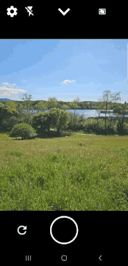

# Jetpack Camera App 📸

Jetpack Camera App (JCA) is a camera app, focused on features used by app developers, and built 
entirely with CameraX, Kotlin and Jetpack Compose. It follows Android 
design and development best practices and it's intended to be a useful reference for developers and
OEMs looking to validate their camera feature implementations.

# Development Environment ⚒️ 

This project uses the gradle build system, and can be imported directly into Android Studio.

Currently, Jetpack Camera App is built using the Android Gradle Plugin 8.4, which is only compatible
with Android Studio Jellyfish or newer.

# Architecture 📐

JCA is built with [modern android development (MAD)](https://developer.android.com/modern-android-development) principles in mind,
including [architecture and testing best practices](https://developer.android.com/topic/architecture).

The app is split into multiple modules, with a clear separation between the UI and data layers.

# Testing 🧪

Thorough testing is a key directive of JCA. We use [Compose Test](https://developer.android.com/develop/ui/compose/testing) and
[UI Automator](https://developer.android.com/training/testing/other-components/ui-automator) to write instrumentation
tests that run on-device.

These tests can be run on a connected device via Android Studio, or can be tested on an Android
Emulator using built-in Gradle Managed Device tasks. Currently, we include Pixel 2 (API 28) and
Pixel 8 (API 34) emulators which can be used to run instrumentation tests with:

`$ ./gradlew pixel2Api28DebugAndroidTest` and
`$ ./gradlew pixel8Api34DebugAndroidTest`

## Source Code Headers

Every file containing source code must include copyright and license
information. This includes any JS/CSS files that you might be serving out to
browsers. (This is to help well-intentioned people avoid accidental copying that
doesn't comply with the license.)

Apache header:

    Copyright (C) 2024 The Android Open Source Project

    Licensed under the Apache License, Version 2.0 (the "License");
    you may not use this file except in compliance with the License.
    You may obtain a copy of the License at

        https://www.apache.org/licenses/LICENSE-2.0

    Unless required by applicable law or agreed to in writing, software
    distributed under the License is distributed on an "AS IS" BASIS,
    WITHOUT WARRANTIES OR CONDITIONS OF ANY KIND, either express or implied.
    See the License for the specific language governing permissions and
    limitations under the License.
